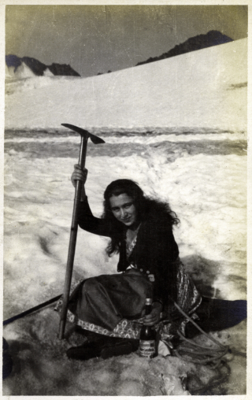

## Summary  

Alice Bischitzky (1901–1987) was born in Prague, married in Vienna, and lived through the tumultuous interwar period, World War II, and post‑war Europe. After leaving Germany in 1933 she returned to Prague, then emigrated to London in 1935. She remained in Britain for the rest of her life, living in Wimbledon and later Bath. Alice’s family background includes a Czech Jewish lineage; her father was Emil Bischitzky, and she had two brothers. She married Robert Schrecker in 1921, with whom she raised three sons—Peter Theodor, Martin Gerhart, and Bruno Tom. Alice died in Bath on 8 January 1987 and was buried in Somerset.

---

<figure markdown="span">
  {: align=center }
  <figcaption>Alice 1921 on holiday in Telfes, Austria</figcaption>
</figure>

## Biography  

### Early Life (1901–1920)  
- **24 December 1901** – Alice Bischitzky was born in Prague, then part of the Austro‑Hungarian Empire. Her parents were **Emil Bischitzky** (1868–1948) and **Gabriella Heller** (1875–1962).  
- Alice had two brothers: **Otto Josef Bischitzky** (1898–1900) and **Robert Bischitzky** (1900–1942).  
- Prague at the turn of the century was a multicultural city with significant Jewish, German, and Czech populations. The city’s intellectual climate was shaped by the decline of imperial authority and the rise of nationalist movements.

### Marriage (1921)  
- **18 December 1921** – Alice married **Robert Schrecker** (1893–1957) at the Tempelgasse Synagogue in Vienna, Austria.  
- The marriage took place during a period of relative stability in the First Austrian Republic but amid growing anti‑semitic sentiment across Europe.  
- Alice and Robert had three sons: **Peter Theodor Schrecker** (1923–2020), **Martin Gerhart Schrecker** (1925–2001), and **Bruno Tom Schrecker** (born 1928).

### Early Adult Years in Germany (1933)  
- **1933** – Alice departed from Frankfurt am Main, Hessen, Germany. The same year Adolf Hitler was appointed Chancellor of Germany, marking the beginning of the Nazi regime.  
- She returned to Prague that same year, likely in response to increasing persecution of Jews in Germany.

### Emigration to the United Kingdom (1935–1940)  
- **1935** – Alice arrived in London, England. The interwar period saw many European Jews seeking refuge from rising fascism.  
- By **29 September 1939**, she was recorded as living at **138 Dora Road, Wimbledon** in London. The date coincides with the outbreak of World War II; many refugees were already settled in Britain, though they faced restrictions and uncertainty.

### Post‑War Life in England (1940–1987)  
- After the war, Alice continued to reside in London. The 1960s saw her relocate to **Bath, Somerset**, a historic city known for its Georgian architecture and Roman baths.  
- She remained in Bath until her death on **8 January 1987** at the residence known as Corston Bath.  
- Alice was buried on **16 January 1987** in Somerset, England.

### Later Years and Legacy  
- Alice’s life spanned significant historical events: the dissolution of the Austro‑Hungarian Empire, both World Wars, the Holocaust, and the Cold War.  
- She witnessed dramatic changes in Europe—from imperial rule to republican governments, from fascist regimes to democratic societies.  
- Her migration pattern—Prague → Frankfurt → Prague → London → Bath—mirrors the broader experience of many Central European Jews who fled persecution and rebuilt their lives in Britain.

---

### Key Dates  

| Date | Event |
|------|-------|
| 24 Dec 1901 | Birth in Prague |
| 18 Dec 1921 | Marriage to Robert Schrecker (Vienna) |
| 1933 | Departure from Frankfurt; return to Prague |
| 1935 | Arrival in London |
| 29 Sep 1939 | Residence listed at 138 Dora Road, Wimbledon |
| 1962 | Recorded residence in Bath |
| 8 Jan 1987 | Death in Bath |
| 16 Jan 1987 | Burial in Somerset |

---

### Historical Context  

- **1901–1918**: Prague was a key cultural center in the Austro‑Hungarian Empire; Jewish communities had long-standing traditions but faced periodic discrimination.  
- **1918–1933**: The First Austrian Republic and the First Czechoslovak Republic were marked by political instability, economic challenges, and rising nationalism.  
- **1933–1945**: The rise of Nazism in Germany and the spread of anti‑semitic policies forced many Jews to flee. Britain accepted a limited number of refugees, often under strict conditions.  
- **1945–1960s**: Post‑war reconstruction in Britain, the welfare state’s development, and the Cold War shaped daily life.  
- **1960s–1987**: Britain experienced social change, including decolonization and the expansion of civil liberties. Bath became a desirable residential area for retirees.

---

### Family Connections  

- **Father**: Emil Bischitzky (1868–1948) – a Czech Jewish businessman.  
- **Mother**: Gabriella Heller (1875–1962) – a Czech Jewish woman.  
- **Brothers**: Otto Josef Bischitzky (1898–1900) and Robert Bischitzky (1900–1942).  
- **Spouse**: Robert Schrecker (1893–1957) – an Austrian Jewish businessman.  
- **Children**: Peter Theodor Schrecker (1923–2020), Martin Gerhart Schrecker (1925–2001), Bruno Tom Schrecker (born 1928).

---

**Alice Bischitzky’s life is a testament to the resilience of individuals who navigated the shifting political landscapes of 20th‑century Europe, maintaining family ties and adapting to new homes across borders.**

---

*Created using openai/gpt-oss-20b in LM Studio from data collected in RootsMagic 11. 
This biography presents only objective facts drawn from the provided records, without subjective interpretation.*